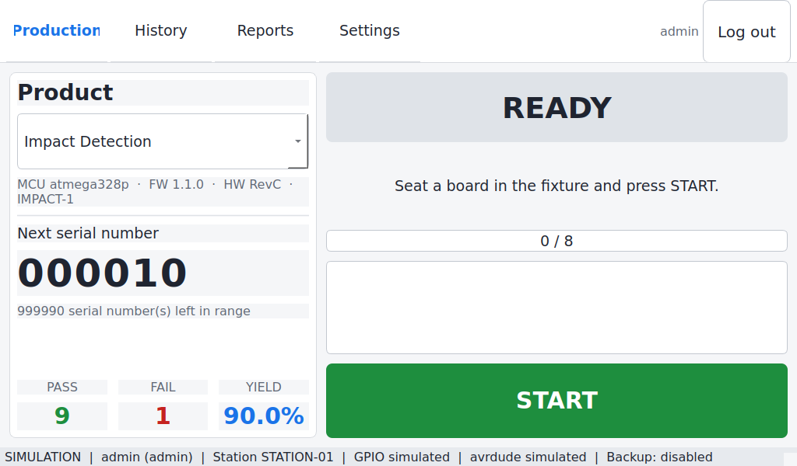

# RPi Sensor Programming & Manufacturing Traceability Station

A manufacturing-grade touchscreen application for **Raspberry Pi 4B (Trixie 64-bit)**
that programs AVR sensor controllers over SPI ISP, writes and verifies EEPROM
manufacturing data, controls serial numbers, and keeps full production
traceability with reporting, Excel export and network backup.

Built to the *Software Requirements Specification — Raspberry Pi Based Sensor
Programming & Manufacturing Traceability Station*. It replaces Arduino IDE based
programming with a fixed, operator-proof cycle.



## What it does

Press **START** with a board in the fixture and the station runs one fixed cycle:

```
detect fixture → read AVR signature → program HEX → verify flash
              → write EEPROM manufacturing data → verify EEPROM
              → log result → increment serial number (PASS only)
```

A failed unit never consumes a serial number — the next board reuses it.

## Install

On the station (Raspberry Pi OS Trixie, 64-bit):

```bash
git clone <this-repo> progstation && cd progstation
sudo ./install.sh
```

The installer sets up SPI, a service account, a virtual environment, the systemd
units and the database, then prints the one-time administrator password.

## Try it without hardware

Every command accepts `--simulate`, which swaps in a simulated programmer and a
simulated GPIO panel. Nothing else changes, so this is the way to evaluate the
tool, run acceptance checks, or develop on a laptop.

```bash
pip install -e ".[dev,gui]"

progstation --simulate init
progstation --simulate project add --name TempSensor --mcu atmega328p \
    --hex firmware/temp-sensor-1.4.0.hex --recommended-map \
    --signature 0x1e950f --hw-revision RevC --variant TS-100 \
    --firmware-version 1.4.0 --serial-start 1000
progstation --simulate program --project TempSensor --operator op1
progstation --simulate report --period daily
progstation --simulate gui --windowed
```

## Command line

Everything the touchscreen does is scriptable, which is what makes the station
usable from line automation and FAT/SAT scripts.

| Command | Purpose |
|---|---|
| `progstation status` | Station health: GPIO backend, avrdude, database, backup |
| `progstation init` | Prepare a fresh station and create the first administrator |
| `progstation project add \| list \| show \| serial` | Configure products, preview their EEPROM block, manage counters |
| `progstation user add \| list \| passwd \| set` | User and role management |
| `progstation program --project P --operator op1` | Run one or more programming cycles |
| `progstation history [--export x.xlsx]` | Search the production log |
| `progstation report --period daily\|weekly\|monthly` | Production summary, optionally to XLSX |
| `progstation trace <serial>` | Full genealogy of one unit |
| `progstation backup run \| status` | Network backup |
| `progstation audit` | Security audit trail |
| `progstation doctor` | Show the real avrdude command and probe the ISP bus |
| `progstation selftest` | FAT/SAT acceptance checks |
| `progstation gui` | Start the touchscreen application |

Add `--json` to any command for machine-readable output.

## Hardware

| Signal | GPIO (BCM) | Notes |
|---|---|---|
| MOSI | 10 | SPI0, through the level shifter |
| MISO | 9 | SPI0 |
| SCLK | 11 | SPI0 |
| RESET | 25 | Driven by avrdude's `linuxspi` driver |
| Green LED | 17 | Blinks while busy, steady on PASS |
| Red LED | 27 | Steady on FAIL |
| Buzzer | 22 | One beep PASS, three beeps FAIL |
| Start button | 23 | Active low, internal pull-up |
| Fixture detect | 24 | Active low, internal pull-up |

The AVR target must be powered from the fixture and level-shifted to 5 V if it
is not a 3.3 V part — the Pi's GPIO is **not** 5 V tolerant.

## EEPROM manufacturing data

Each project carries a JSON map describing its manufacturing block. The
recommended 32-byte layout from the SRS:

| Offset | Size | Field | Type |
|---|---|---|---|
| 0 | 4 | Serial number | `uint32` big-endian |
| 4 | 4 | HW revision | ASCII |
| 8 | 8 | Product variant | ASCII |
| 16 | 4 | Manufacturing date | packed BCD `YYYYMMDD` |
| 20 | 8 | Firmware version | ASCII |
| 28 | 2 | *Reserved* | left at the fill byte |
| 30 | 2 | CRC-16/CCITT over bytes 0–29 | `crc16` |

Legacy products need no map at all: set `SNAddress` and `MFGAddress` and the
station synthesises the two-field layout, touching nothing else in the EEPROM.
Field types available: `uint8/16/32`, `ascii`, `bytes`, `bcd`, `date_bcd`,
`date_ymd`, `crc8`, `crc16`, `checksum8`.

Preview exactly what will be written before releasing a project:

```bash
progstation project show TempSensor
```

## Documentation

- [User manual](docs/USER_MANUAL.md) — operator and administrator guide
- [Maintenance guide](docs/MAINTENANCE.md) — troubleshooting, backup, recovery
- [Requirements traceability](docs/TRACEABILITY.md) — SRS section → implementation → test
- [Test report](docs/TEST_REPORT.md) — verification results

## Development

```bash
pip install -e ".[dev,gui]"
pytest -q
```

The core is deliberately free of GUI and GPIO imports, so the workflow, EEPROM
engine and reporting are all testable headless.

## Project layout

```
progstation/
  app.py            application context (config + db + hardware + services)
  cli.py            command line interface
  selftest.py       FAT/SAT acceptance checks
  config.py         YAML configuration
  errors.py         error taxonomy -> ProductionLog.Error codes
  core/             ihex, eeprom maps, avrdude backend, serials, workflow
  db/               schema.sql and the SQLite layer
  hw/               GPIO abstraction and the panel (LEDs, buzzer, switches)
  security/         password hashing, roles, audit
  reports/          aggregation engine and XLSX export
  backup/           SMB network backup
  gui/              PyQt touchscreen screens
```
